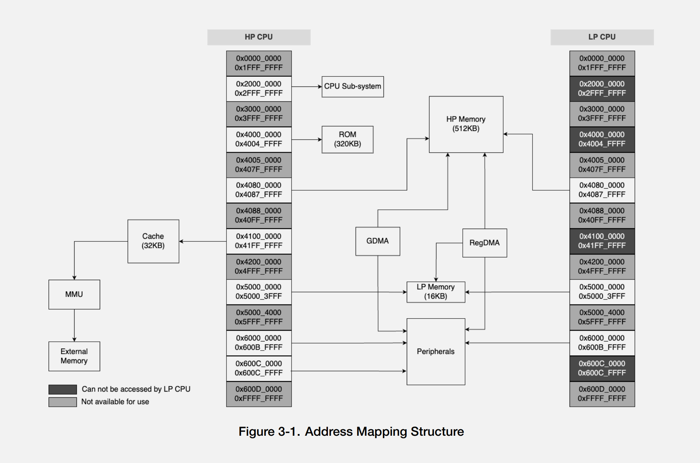

# ESP32-C5 Research
(updated 05172025)

## Notes
* supported only in ESP-IDF 5.3+
* Active development in ESP-IDF implementing features
* Currently must pass --preview to idf.py (`idf.py --preview`) to use the ESP32-C5 in ESP-IDF even from master

## Docs
### PDFs
* [Datasheet (V0.1 Preleminary)](./documents/ESP32_C5_Chip_Datasheet_V0.1_PRELIMINARY_EN.pdf)
* [Hardware Design Guide](./documents/esp-hardware-design-guidelines-en-master-esp32c5.pdf)
* [ESP-IDF 5.3 Programming Guuide](./documents/esp-idf-en-v5.3-esp32c5.pdf)

### Linked Docs
* [ESP32-C5-DevKitC-1 Official User Guide](https://docs.espressif.com/projects/esp-dev-kits/en/latest/esp32c5/esp32-c5-devkitc-1/user_guide.html)
* [esp32pins.com has a page on it (not directly linkable)](https://esp32pins.com)
* [ESP-DEV-KITS Docs](https://github.com/espressif/esp-dev-kits/blob/master/docs/en/esp32-c5-devkitc-1/user_guide.rst)

## ESP-IDF
* [ESP-IDF Github](https://github.com/espressif/esp-idf)
	* [ESP-IDF Examples Supporting the ESP32-C5](https://github.com/search?q=repo%3Aespressif%2Fesp-idf+path%3A%2F%5Eexamples%5C%2F%2F+ESP32-C5+README&type=code)
* [ESP-IDF Programming Guide for ESP32-C5 from Master](https://docs.espressif.com/projects/esp-idf/en/latest/esp32c5/index.html)

## Hardware
### Features

### Memory Map
[Figure 3.1.5 Address Mapping Structure Page 32 ESP32_C5_Chip_Datasheet_V0.1_PRELIMINARY_EN.pdf](./documents/ESP32_C5_Chip_Datasheet_V0.1_PRELIMINARY_EN.pdf#page=32)



**Named Regions**
| Name                        | Start       | End         | Length      |
|-----------------------------|-------------|-------------|-------------|
| CPU-Sub-System              | 0x2000_0000 | 0x2FFF_FFFF | 0xFFF_FFFF  |
| ROM                         | 0x4000_0000 | 0x4004_FFFF | 0x4_FFFF    |
| HP-Memory                   | 0x4080_0000 | 0x40FF_FFFF | 0x7_FFFF    |
| Cache-MMU-External-Memory   | 0x4100_0000 | 0x41FF_FFFF | 0xFF_FFFF   |
| LP-Memory                   | 0x5000_0000 | 0x5000_3FFF | 0x3_FFF     |
| Peripherals                 | 0x6000_0000 | 0x600B_FFFF | 0xB_FFFF    |
| Peripherals                 | 0x600C_0000 | 0x600B_FFFF | 0xFFFF      |

### Info From Esp-IDF Tools
`esptool.py --chip auto chip_id/read_mac/flash_id/read_flash_status`  
Chip: ESP32-C5 (revision v1.0)  
Features: WiFi 6, BT 5, IEEE802.15.4  
Crystal: 48MHz  
  
`esptool.py --chip auto get_security_info`
```
Security Information:
=====================
Flags: 0x00000000 (0b0)
Key Purposes: (0, 0, 0, 0, 0, 0, 19)
  BLOCK_KEY0 - USER/EMPTY
  BLOCK_KEY1 - USER/EMPTY
  BLOCK_KEY2 - USER/EMPTY
  BLOCK_KEY3 - USER/EMPTY
  BLOCK_KEY4 - USER/EMPTY
  BLOCK_KEY5 - USER/EMPTY
Chip ID: 23
API Version: 2
Secure Boot: Disabled
Flash Encryption: Disabled
SPI Boot Crypt Count (SPI_BOOT_CRYPT_CNT): 0x0
```

### Instruction Set
**High Power (HP) CPU**
RISC-V 32-bit (RV32IMAC)  
* Base Integar Instruction Set 32-bit (I)
* Multiplication and Divison (M)
* Atomic Instructions (A)
* Compressed Instructions (C)
    * Zc extensions (Zcb, Zcmp, and Zcmt)
* Custom Hardware Loop Instructions (Xhwlp)

**Low Power (LP) CPU**  
RISC-V 32-bit (RV32IMAC)